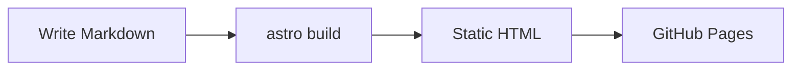
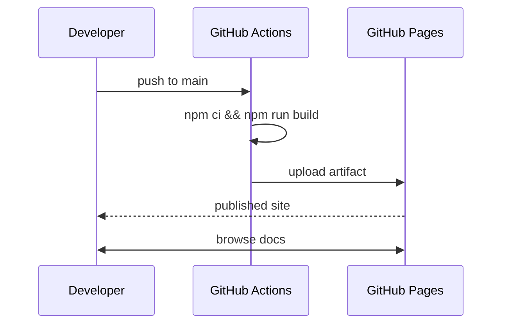

Diagrams are written as fenced `mermaid` code blocks and rendered in the browser by
[`astro-mermaid`](https://www.npmjs.com/package/astro-mermaid). They follow the site's
light/dark toggle automatically, so a diagram is legible in both themes without a
second copy.

## Flowchart

````markdown

````

Renders as:


## Sequence diagram

Note that bidirectional arrows in a `sequenceDiagram` use `<<->>`. The `<-->` form is
flowchart syntax and Mermaid rejects it here with a parse error.



## Notes

- The integration must be listed **before** `starlight()` in `astro.config.mjs`, or its
  remark plugin never sees the fences.
- Keep `@mermaid-js/layout-elk` installed — it is a declared peer of `astro-mermaid`.
- Rendering happens client-side, so a diagram that fails to parse leaves an error in the
  browser console rather than failing the build. Check the console when a diagram does
  not appear.
